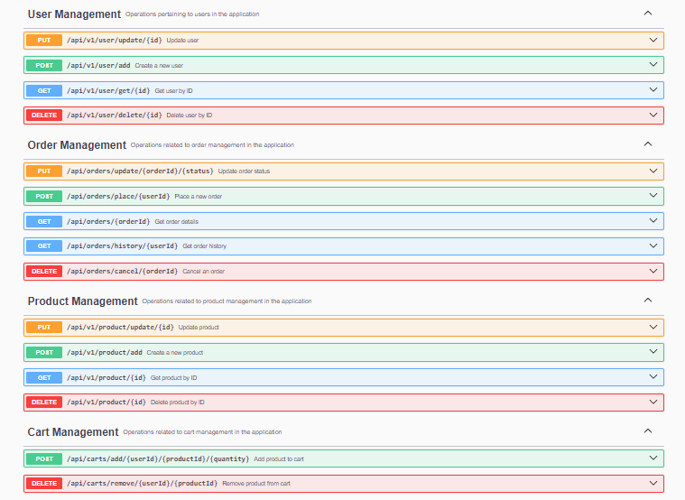

# E-Commerce-Application

- The E-Commerce Application is built using Java and Spring Boot, with  scalability, and ease of maintenance. The backend uses Spring Data JPA to interact with a h2 database, making it easy to manage and store important entities such as users, products, orders, and more. 

# Features

## User:-

- Fetch  products based on product id
- Adding & deleting products to cart
- Ordering products and fetching order status

# Technologies:
- Java 17 or above
- Spring Boot 3.0
- Maven
- h2 database
- Spring Data JPA

# Running the app
1. Clone the repository: git clone https://github.com/IsmaelMours/E-commerce.git
2. Import the project into STS:
  - Click File > Import...
  - Select Maven > Existing Maven Projects and click Next
  - Browse to the project directory and click Finish
3. Update the values in application.properties with your h2 database connection details.
4. Run the app: Right-click the project in the Package Explorer and click Run As > Spring Boot App.

# API Controllers

## Get swagger link below to access api
http://localhost:8080/swagger-ui/index.html

# Thank You
